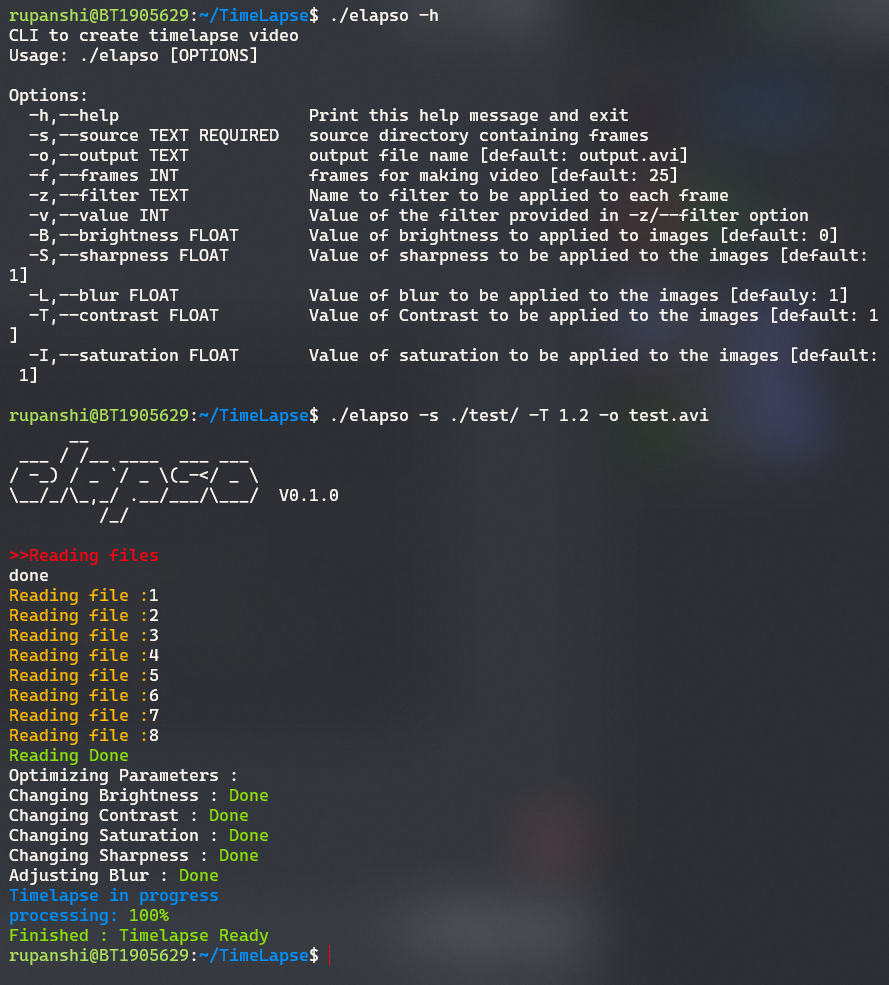

# _**ELAPSO**_  

Elapso is a CLI tool written in C++ to enable users to automate and optimize the process of making a Timelapse video. This algorithmic toolkit provides the functionality of adjusting the _Contrast, Saturation, Brightness, Sharpness_ and _Blurness_ of subsequent images that lead to more detailed and broad manipulation of the Timelapse according to the users need.

<br/>

<p align="center">
<a href="https://github.com/GFG-CLUB-KIIT/TimeLapse" target="_blank"></a>
&nbsp;</p>

<br/> 

****
<br/>

## **Environment Setup** 🛠️
<br/>

- Upgrade and then Install OpenCV
```
 sudo apt-get update -y && sudo apt-get upgrade

 sudo apt-get install opencv-data libopencv-dev
```
- Install g++ and CMake
```
sudo apt-get install g++ cmake
```

<br/>

****
<br/>


## **Running the project** 🏃🏻‍♀️
<br/>

- Clone the github repository 
```
git clone https://github.com/GFG-CLUB-KIIT/TimeLapse.git
```

- Start Building Elapso 
```
cmake .

cmake --build .
```
- Get started with Elapso
```
./elapso -h
```
<br/>

****
<br/>

## **Commands** 📤
<br/>

**Usage** - ``` ./elapso [OPTIONS] ```

```
Options:

  -h,--help                   Print this help message and exit
  -s,--source TEXT REQUIRED   source directory containing frames
  -o,--output TEXT            output file name [default: output.avi]
  -f,--frames INT             frames for making video [default: 25]
  -z,--filter TEXT            Name to filter to be applied to each frame
  -v,--value INT              Value of the filter provided in -z/--filter option
  -B,--brightness FLOAT       Value of brightness to applied to images [default: 0]
  -S,--sharpness FLOAT        Value of sharpness to be applied to the images [default: 1]
  -L,--blur FLOAT             Value of blur to be applied to the images [defauly: 1]
  -T,--contrast FLOAT         Value of Contrast to be applied to the images [default: 1]
  -I,--saturation FLOAT       Value of saturation to be applied to the images [default: 1]
```
<br/>

****
<br/>

## **Features** 📄
<br/>

- [x] Parameter Filters
- [x] Timelapse 
- [x] Custom Framerate
- [ ] Support for Windows
- [ ] Algorithm that detects changes in Shutter speed, Aperture and ISO
- [ ] Filtering frame drops and image anomalies

<br/>

****
<br/>
## **Screenshot**



<br/>

****
<br/>
